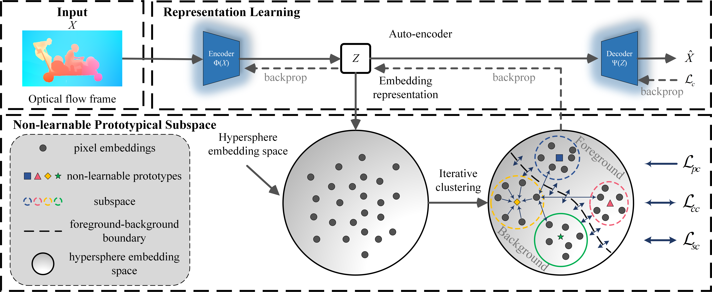

# ClusterNet

This is an official implementation of "Online Unsupervised Video Object Segmentation via Contrastive Motion Clustering" (IEEE TCSVT).

<div align="center">
  
</div>

<div>
  <h4 align="left">
Papers: <a href="https://ieeexplore.ieee.org/document/10159996" target="_blank">
</a>  <a href="https://arxiv.org/abs/2306.12048" target="_blank">
</a>
  </h4>
</div>

## Prerequisites

The training and testing experiments are conducted using PyTorch 1.8.1 with a single NVIDIA TITAN RTX GPU with 24GB Memory.

- python 3.8
- pytorch 1.8.1
- torchvision 0.9.1
```bash
conda create -n ClusterNet python=3.8
conda activate ClusterNet
conda install pytorch==1.8.1 torchvision==0.9.1 cudatoolkit=10.2 -c pytorch
```

Other minor Python modules can be installed by running
```bash
pip install opencv-python einops
```

## Datasets

- <a href="https://davischallenge.org/davis2017/code.html#unsupervised" target="_blank">*DAVIS<sub>16</sub>*</a>: We perform online clustering and evaluation on the validation set. However, please download *DAVIS<sub>17</sub>* (Unsupervised 480p) to fit the code.
- <a href="https://lmb.informatik.uni-freiburg.de/resources/datasets/" target="_blank">*FBMS*</a>: This dataset contains videos of multiple moving objects, providing test cases for multiple object segmentation.
- <a href="https://web.engr.oregonstate.edu/~lif/SegTrack2/dataset.html" target="_blank">*SegTrackV2*</a>: Each sequence contains 1-6 moving objects. 

Following the evaluation protocol in <a href="https://arxiv.org/abs/1901.03360" target="_blank">CIS</a>, we combine multiple objects as a single foreground and use the region similarity $\mathcal{J}$ to measure the segmentation performance for the *FBMS* and *SegTrackV2*. Binary Mask: [<a href="https://drive.google.com/file/d/16zzb10mVNuRAC3lrJ984jxWthcTWqXvl/view?usp=sharing" target="_blank">FBMS</a>][<a href="https://drive.google.com/file/d/1twATOkSw7D3ZyH7wLmwApF8WL_-jhh9m/view?usp=sharing" target="_blank">SegTrackV2</a>]
- Path configuration: Dataset path settings is ```--data_dir``` in ```main.py```.
```python
parser.add_argument('--data_dir', default=None, type=str, help='dataset root dir')
```

- The datasets directory structure will be as follows:
```text
|--DAVIS2017
|   |--Annotations_unsupervised
|   |   |--480p
|   |--ImageSets
|   |   |--2016
|   |--Flows_gap_1_${flow_method}
|       |--Full-Resolution
|--FBMS
|   |--Annotations_Binary
|   |--Flows_gap_1_${flow_method}
|--SegTrackv2
    |--Annotations_Binary
    |--Flows_gap_1_${flow_method}
```

## Precompute optical flow

- The optical flow is estimated by using the <a href="https://github.com/NVlabs/PWC-Net" target="_blank">PWCNet</a>, <a href="https://github.com/princeton-vl/RAFT" target="_blank">RAFT</a> and <a href="https://github.com/drinkingcoder/FlowFormer-Official" target="_blank">FlowFormer</a>. In datasets directory, the variable ```flow_method``` is ```PWC```, ```RAFT``` and ```FlowFormer```, respectively.

- The flows are resized to the size of the original image (same as <a href="https://github.com/charigyang/motiongrouping" target="_blank">Motion Grouping</a>), with each input frame having a size of $480\times854$ for the *DAVIS<sub>16</sub>* and $480\times640$ for the *FBMS* and *SegTrackV2*. We convert the optical flow to 3-channel images with the standard visualization used for the optical flow and normalize it to $[-1, 1]$, and use only the previous frames for the optical flow estimation in the online setting.

## Train & Inference

To train the ClusterNet model on a GPUs, you can use:
```bash
bash scripts/main.sh
```

In the ```main.sh``` file, first activate your Python environment and set ```gpu_id``` and ```data_dir```. Then set the hyperparameters ```batch_size```, ```n_clusters```, and ```threshold``` to 16, 30, and 0.1, respectively.

## Outputs

The model files and checkpoints will be saved in ```./checkpoints/${exp_id}```.

```.pth``` files with ```_${sequence_name}``` store the network weights that initialize our autoencoder to train on *DAVIS<sub>16</sub>* through the loss of optical flow reconstruction.

The segmentation results will be saved in ```./results/${exp_id}```. The evaluation criterion is the mean region similarity $\mathcal{J}$.

| Optical flow prediction | Method | Mean $\mathcal{J}\uparrow$ |
|:--:|:--:|:--:|
|<a href="https://arxiv.org/abs/1709.02371" target="_blank">PWC-Net</a>|<a href="https://arxiv.org/abs/2104.07658" target="_blank">MG</a><br>ClusterNet|63.7<br>67.9(+4.2)|
|<a href="https://arxiv.org/abs/2003.12039" target="_blank">RAFT</a>|<a href="https://arxiv.org/abs/2104.07658" target="_blank">MG</a><br>ClusterNet|68.3<br>72.0(+3.7)|
|<a href="https://arxiv.org/abs/2203.16194" target="_blank">FlowFormer</a>|<a href="https://arxiv.org/abs/2104.07658" target="_blank">MG</a><br>ClusterNet|70.3<br>75.4(+5.1)|

## Citation

If you find our work useful in your research please consider citing our paper!

```bib
@ARTICLE{ClusterNet,
  author={Xi, Lin and Chen, Weihai and Wu, Xingming and Liu, Zhong and Li, Zhengguo},
  journal={IEEE Transactions on Circuits and Systems for Video Technology}, 
  title={Online Unsupervised Video Object Segmentation via Contrastive Motion Clustering}, 
  year={2023}
}  
```

## Contact
If you have any questions, please feel free to contact Lin Xi (xilin1991@buaa.edu.cn).

## Acknowledgement
This project would not have been possible without relying on some awesome repos: <a href="https://github.com/charigyang/motiongrouping" target="_blank">Motion Grouping</a>, <a href="https://github.com/NVlabs/PWC-Net" target="_blank">PWCNet</a>, <a href="https://github.com/princeton-vl/RAFT" target="_blank">RAFT</a> and <a href="https://github.com/drinkingcoder/FlowFormer-Official" target="_blank">FlowFormer</a>. We thank the original authors for their excellent work.
